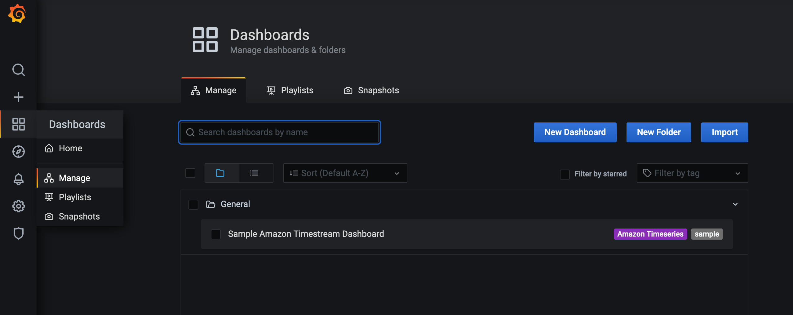

## Amazon Timestream with Amazon Kinesis and Grafana Demo

Sample application that reads events from Amazon Kinesis Data Streams and batches records to Amazon Timestream,
visualizing results via Grafana.

### Overall architecture

The overall serverless architecture will work on events streamed to [Amazon Kinesis](https://aws.amazon.com/kinesis/)
Data Streams, pulled by an [Apache Flink](https://flink.apache.org/)
analytics application hosted on [Amazon Kinesis Data Analytics](https://aws.amazon.com/de/kinesis/data-analytics/)
to be batch-inserted in [Amazon Timestream](https://aws.amazon.com/timestream/) database. Finally, data will be
visualized directly from the Timestream database by a Grafana dashboard using the
[Timestream datasource plugin](https://grafana.com/grafana/plugins/grafana-timestream-datasource).


The sample setup will assume that events are being streamed via Amazon Kinesis service. However, this is not a
precondition as any other streaming service like Kafka provisioned on EC2 or
using [Amazon Managed Streaming for Apache Kafka(Amazon MSK)](https://aws.amazon.com/msk/) can be used in a similar
setup. To simulate devices streaming data to the Kinesis data stream, an AWS Lambda function produces events and pushes
them to Kinesis data stream, the events streamed will contain information similar to the below sample.

|DeviceID                                |Timestamp                     |temperature |humidity |voltage | watt |
|---------------------------------------|:--------------------------:|:----------:|:-------:|:------:|-----:| 
|b974f43a-2f04-11eb-adc1-0242ac120002    |2020-09-13 11:49:42.5352820 |15.5        |70.3     |39.7    |301.44|

In Timestream data will be modeled as follows

|DeviceID (Dimension)                    | measure_value::double    | measure_name | measure_type |time                       |
|----------------------------------------|:------------------------:|:------------:|:-------------|:-------------------------:|
|b974f43a-2f04-11eb-adc1-0242ac120002    |15.5                      |temperature   |DOUBLE        |2020-09-13 11:49:42.5352820|
|b974f43a-2f04-11eb-adc1-0242ac120002    |70.3                      |humidity      |DOUBLE        |2020-09-13 11:49:42.5352820|
|b974f43a-2f04-11eb-adc1-0242ac120002    |39.7                      |voltage       |DOUBLE        |2020-09-13 11:49:42.5352820|
|b974f43a-2f04-11eb-adc1-0242ac120002    |301.4                     |watt          |DOUBLE        |2020-09-13 11:49:42.5352820|

The Device ID is mapped as a
[Dimension](https://docs.aws.amazon.com/timestream/latest/developerguide/API_Dimension.html)
and the Property fields measured mapped as
[`measure_name`](https://docs.aws.amazon.com/timestream/latest/developerguide/concepts.html)
, finally the value of the measure is mapped to the
[`measure_value`](https://docs.aws.amazon.com/timestream/latest/developerguide/concepts.html)
.`datatype` is set as double in this case.
[Check the best practices on mapping](https://docs.aws.amazon.com/timestream/latest/developerguide/best-practices.html#data-modeling)
and data modeling for a better insight on mapping your data.

## Getting started

### 1. Building and packaging Amazon Kinesis Data Analytics for Apache Flink application

This project provides 2 sample applications built with different toolsets. You can use either one of those as the
application to be deployed.

1. To build an application using Java and Apache Maven, refer to [instructions here](./analytics/README.md)
2. To build an application using Kotlin and Gradle, refer to [instructions here](./analytics-kotlin/README.md)

### 2. Deploy infrastructure

Infrastructure deployment will automatically use packaged application jar and upload it to an
[Amazon S3](https://aws.amazon.com/s3/) bucket. The infrastructure utilizes multiple stacks built using an AWS CDK
project with Python3 language. For more information on working with the CDK and Python,
[check the following guide](https://docs.aws.amazon.com/cdk/latest/guide/work-with-cdk-python.html). To deploy all
stacks use the `--all` option when invoking `cdk deploy`

1. Navigate to cdk folder
1. Follow [instructions here](cdk/README.md) to create virtual environment and build stacks
1. Make sure CDK environment is bootstrapped in the account and region you're deploying stacks to, as the stacks utilize
   assets to deploy the Kinesis Data Analytics Flink application
   ```shell
   $ cdk bootstrap
   ```
1. Deploy infrastructure using packaged applications
   1. To deploy infrastructure and use `Java` application as basis for Kinesis analytics application, you can directly
      deploy the CDK stacks
      ```shell
      $ cdk deploy --all
      ```
   1. To deploy infrastructure and use `Kotlin` application as basis for Kinesis analytics application, you can
      customize the stacks using [context variables](https://docs.aws.amazon.com/cdk/latest/guide/context.html)
      ```shell
      $ cdk deploy --context kda_path=../analytics-kotlin/build/libs/analytics-timestream-kotlin-sample-all.jar --all
      ```

#### Check deployed resource and kick-off pipeline

Once CDK stacks are deployed successfully you can check created AWS resources. You can directly run script `./setup.sh`
or follow below instructions.

1. Amazon Kinesis Data Stream

   Deployed through stack `amazon-kinesis-stream-stack` and is ready to receive events from sample producer.

   

   Producer resources are deployed through stack `sample-kinesis-stream-producer`. You can check the Lambda function
   monitoring and logs to make sure it's being regularly called and sending events to the stream.

   For more information on how the producer
   works [check documentation](cdk/stacks/sample_kinesis_stream_producer/README.md).

1. Amazon Kinesis Data Analytics for Apache Flink Application

   Deployed through stack `amazon-kinesis-analytics`. Although the application is created through the stack it would
   still not be running.

   To run the application and kick-off the pipeline, simply pickup the application name from the stack
   output `KdaApplicationName`.

   Follow instructions
   under [Run the Application section](https://docs.aws.amazon.com/kinesisanalytics/latest/java/get-started-exercise.html#get-started-exercise-7)
   or run the following command
    ```shell
    $ aws kinesisanalyticsv2 start-application --application-name amazon-kinesis-analytics \
      --run-configuration '{ "ApplicationRestoreConfiguration": { "ApplicationRestoreType": "SKIP_RESTORE_FROM_SNAPSHOT" } }'
    ```
1. Amazon S3 bucket to store the JAR package for the application and application role

   Deployed through stack `flink-source-bucket`
1. Amazon Timestream Database

   Deployed through stack `amazon-timestream`
1. Grafana dashboard deployment

   Deployed through stack `grafana`. To check the created Grafana check the output `MyFargateServiceServiceURL...`.
   1. Grafana deployed using Amazon ECS on AWS Fargate for compute
   1. Amazon Elastic File System (Amazon EFS) for storage
   1. AWS SecretsManager Secret storing Grafana `admin` user password. Check the stack output `GrafanaAdminSecret` for
      AWS Secrets Manager Secret's id storing the Grafana admin user's password.

### 3. Visualizing Amazon Timestream values through Grafana

To help you get started with data visualization, we have created a sample dashboard in Grafana that visualizes data sent
to Timestream from the sample producer. You can also check the
following [video tutorial](https://docs.aws.amazon.com/timestream/latest/developerguide/Grafana.html#Grafana.video-tutorial)
or [complete guide](https://docs.aws.amazon.com/timestream/latest/developerguide/Grafana.html) for more information.

1. Install Grafana Datasource plugin

   The [Grafana Amazon Timestream datasource plugin](https://grafana.com/grafana/plugins/grafana-timestream-datasource/installation)
   is automatically installed through the infrastructure stack.
1. Create Grafana Datasource

   To create a Timeseries data source, go to Datasources, click on Add Datasource, search for Timestream, and select the
   Timestream datasource. You can also
   use [programmatic means described here](https://grafana.com/docs/grafana/latest/http_api/data_source/).

   To use the programmatic means to create a data source:
   1. Create an API token to be used. Make sure to replace `<stack grafana.GrafanaAdminSecret.secret_value>` with the
      sceret value, escaping any characters in the password like `$` or `"` with a preceding `\`. And
      replace `<stack grafana.MyFargateServiceServiceURL...>` with the value from stack output.
   ```shell
   $ grafana_token=$(\
    curl -X POST -u "admin:<stack grafana.GrafanaAdminSecret.secret_value>" \
    -H "Content-Type: application/json" \
    -d '{"name":"apikeycurl", "role": "Admin"}' \
    <stack grafana.MyFargateServiceServiceURL...>/api/auth/keys \
    | jq -r .key)
   ```
   1. Create Amazon Timestream datasource
   ```shell
   $ curl -X POST --insecure \
    -H "Content-Type: application/json" -H "Authorization: Bearer ${grafana_token}" \
    -d @./cdk/stacks/grafana/datasource.json \
    <stack grafana.MyFargateServiceServiceURL...>/api/datasources
   ```
1. Create Grafana Dashboard

   Grafana dashboards can be exported and imported as `JSON`. You can find a
   dashboard [sample json in here](cdk/stacks/grafana/dashboard.json). The defined dashboard provides sample variables
   and visualizations by querying directly from Timestream database. The dashboard assumes the Timestream datasource is
   your default datasource.

   To import sample dashboard you
   can [follow instructions here](https://grafana.com/docs/grafana/latest/dashboards/export-import/#importing-a-dashboard)
   or use [programmatic means described here](https://grafana.com/docs/grafana/latest/http_api/dashboard/).

   To use the programmatic means to create a dashboard:
   ```shell
   $ curl -X POST --insecure \
    -H "Content-Type: application/json" -H "Authorization: Bearer ${grafana_token}" \
    -d @./cdk/stacks/grafana/dashboard.json \
    <stack grafana.MyFargateServiceServiceURL...>/api/dashboards/db
   ```
   1. To check created dashboard navigate to <stack grafana.MyFargateServiceServiceURL...>
   1. Login using admin credentials.
   1. Check created dashboard under "Dashboards" -> "Manage"
      

## Clean up

To delete all created stack resources you can use

```shell
  $ cdk destroy --all
```

## Security

See [CONTRIBUTING](CONTRIBUTING.md#security-issue-notifications) for more information.

## License

This library is licensed under the MIT-0 License. See the LICENSE file.

